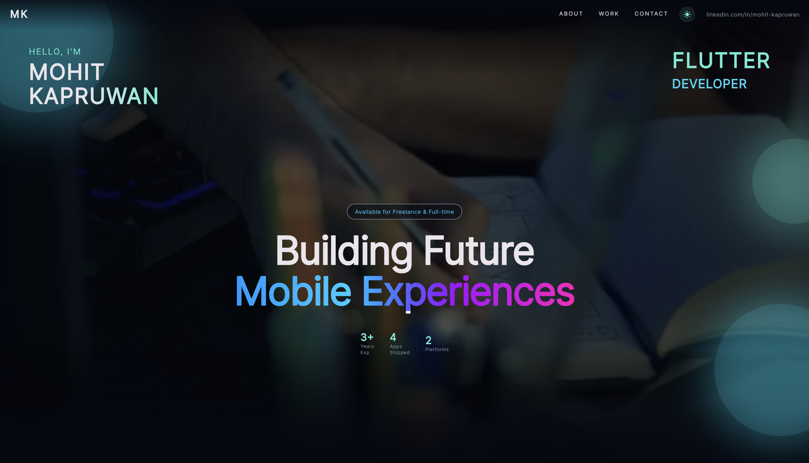
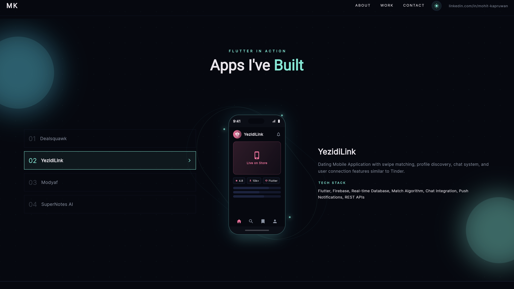

# Mohit Kapruwan — Flutter Portfolio

A modern, fully animated personal portfolio website built with **Flutter** and **Dart**, targeting the **web** platform. It showcases professional experience, shipped projects, technical skills, and contact information with a polished dark/light theme, smooth scroll-reveal animations, and a responsive layout that works on both desktop and mobile browsers.

---

## Screenshots

| Landing | About & Skills | Projects |
|---|---|---|
|  |  |  |
---

## Features

- **Full-screen hero section** with looping video background, typewriter role animation, and gradient text headline
- **Dark / Light theme toggle** with smooth animated transition, persisted via `ValueNotifier`
- **Scroll-reveal animations** — every section fades and slides in as it enters the viewport
- **3D perspective tilt cards** on project cards (mouse-hover only, skipped on mobile)
- **Animated dot-grid background** rendered with a custom `CustomPainter` using sine-wave opacity
- **Skill progress bars** that animate in on scroll visibility trigger
- **Floating tech-badge carousel** with per-badge float animation
- **Phone mockup showcase** with orbiting rings, floating animation, and animated app screen per project
- **Expandable "What I Do" cards** with animated size transition
- **Career timeline** with animated dot-connector and slide-in rows
- **Project carousel** (`PageView`) with arrow navigation, dot indicators, and tilt-card 3D effect
- **Contact form** with validation, mailto launch, and loading state
- **Resume download** button linked to a PDF asset
- **Social links** (GitHub, LinkedIn, Facebook, Instagram) with icon assets
- **Responsive layout** — single breakpoint at `768 px` switches between mobile and desktop layouts
- **PWA-ready** — Flutter web build includes `manifest.json` and service worker

---

## Tech Stack

### Core

| Technology | Version | Purpose |
|---|---|---|
| **Flutter** | ≥ 3.4.0 | UI framework (web target) |
| **Dart** | ≥ 3.4.0 | Programming language |

### Dependencies

| Package | Version | Purpose |
|---|---|---|
| `google_fonts` | ^6.2.1 | Inter typeface via Google Fonts |
| `flutter_animate` | ^4.5.0 | Declarative enter/exit animations (`fadeIn`, `slideY`, `scale`, etc.) |
| `animated_text_kit` | ^4.2.3 | Typewriter effect on the hero role text |
| `visibility_detector` | ^0.4.0+2 | Scroll-triggered animation (fires once on first visibility) |
| `video_player` | ^2.9.2 | Looping muted background video on the landing section |
| `model_viewer_plus` | ^1.10.0 | Interactive 3D Flutter logo (`.glb` model) in the skills section |
| `url_launcher` | ^6.3.0 | Opens external links (store URLs, mailto, social profiles) |

### Dev Dependencies

| Package | Version | Purpose |
|---|---|---|
| `flutter_lints` | ^4.0.0 | Official Flutter lint rule set |
| `flutter_test` | SDK | Widget and unit testing |

---

## Project Structure

```
flutter_portfolio/
├── lib/
│   ├── main.dart                        # App entry point, global themeNotifier
│   ├── constants/
│   │   ├── app_asset.dart               # Centralised asset path constants
│   │   └── app_strings.dart             # Personal info, URLs, and copy strings
│   ├── data/
│   │   └── portfolio_data.dart          # Data models + static lists (career, projects, skills)
│   ├── screens/
│   │   └── home_screen.dart             # Root scaffold, scroll controller, section keys
│   ├── theme/
│   │   └── app_theme.dart               # AppColors, AppColorScheme (ThemeExtension), AppTheme
│   └── widgets/
│       ├── common/
│       │   ├── animated_grid_bg.dart    # Sine-wave animated dot grid (CustomPainter)
│       │   ├── glowing_orb.dart         # Rotating ambient glow circle
│       │   ├── navbar.dart              # Responsive navbar with scroll blur + mobile drawer
│       │   ├── scroll_reveal.dart       # Fade+slide entrance on scroll visibility
│       │   └── tilt_card.dart           # 3D perspective tilt on mouse hover
│       └── sections/
│           ├── landing_section.dart     # Hero — video bg, typewriter, stats row, scroll cue
│           ├── about_section.dart       # Bio text + animated stat cards
│           ├── services_section.dart    # 6 service cards in 2×3 grid
│           ├── technical_expertise_section.dart  # Skill bars + 3D Flutter logo
│           ├── what_i_do_section.dart   # Expandable accordion cards
│           ├── career_section.dart      # Timeline-style career history
│           ├── work_section.dart        # Project carousel with PageView + tilt cards
│           ├── techstack_section.dart   # Floating animated tech badges
│           ├── flutter_showcase_section.dart     # Phone mockup + project detail panel
│           └── contact_section.dart     # Contact form + resume download + footer
├── assets/
│   ├── animations/
│   │   └── flutter_logo.glb            # 3D Flutter logo model
│   ├── icons/
│   │   ├── github.png
│   │   ├── linkedin.png
│   │   ├── facebook.png
│   │   └── instagram.png
│   ├── resume/
│   │   └── demo.pdf                    # Downloadable resume
│   └── videos/
│       └── intro_video.mp4             # Hero background video
├── web/
│   ├── index.html                      # Flutter web entry point
│   ├── manifest.json                   # PWA manifest
│   └── favicon.png
├── pubspec.yaml
├── analysis_options.yaml
└── .gitignore
```

---

## Architecture & Patterns

### State Management
- **`ValueNotifier<ThemeMode>`** — lightweight global notifier for dark/light theme switching, consumed via `ValueListenableBuilder` in the widget tree. No third-party state management library is needed for a single-state portfolio app.

### Theme System
- **`AppColorScheme`** extends `ThemeExtension<AppColorScheme>` — a typed, lerp-capable color scheme registered on both `ThemeData.dark` and `ThemeData.light`.
- Accessed anywhere via the `context.appColors` extension on `BuildContext`.
- Two complete palettes: dark (navy/teal) and light (slate/teal).

### Animation Strategy
| Scenario | Approach |
|---|---|
| Entrance on scroll | `ScrollReveal` widget wrapping `VisibilityDetector` + `flutter_animate` |
| Looping background effects | `AnimationController` with `repeat()` + `AnimatedBuilder` |
| Hover micro-interactions | `MouseRegion` + `AnimatedContainer` / `AnimatedDefaultTextStyle` |
| Page transitions | `AnimatedSwitcher` with `FadeTransition` + `SlideTransition` |
| 3D tilt | `MouseRegion` + `TweenAnimationBuilder<Offset>` + `Matrix4` perspective transform |

### Responsive Design
- Single breakpoint: **768 px** (`isMobile = MediaQuery.of(context).size.width < 768`)
- Mobile: stacked `Column` layouts, reduced font sizes, hamburger nav drawer
- Desktop: side-by-side `Row` layouts, full navigation bar, larger typography

### Data Layer
- All content lives in `lib/data/portfolio_data.dart` as `const` lists — `careerItems`, `projects`, `whatIDoItems`, `techStack`.
- Each `Project` carries a `tintColor` field used to colour-code its phone mockup screen without any switch-on-title logic.
- Personal strings (email, phone, social URLs) are centralised in `lib/constants/app_strings.dart`.
- Asset paths are centralised in `lib/constants/app_asset.dart` with private path prefixes.

---

## Getting Started

### Prerequisites

| Tool | Version |
|---|---|
| Flutter SDK | ≥ 3.4.0 |
| Dart SDK | ≥ 3.4.0 (bundled with Flutter) |
| Chrome / Edge | Latest (for web development) |

Install Flutter: https://docs.flutter.dev/get-started/install

### Installation

```bash
# 1. Clone the repository
git clone https://github.com/Mohit-Kapruwan-MK/flutter-portfolio.git
cd flutter-portfolio

# 2. Install dependencies
flutter pub get

# 3. Run on Chrome (web)
flutter run -d chrome

# 4. Run with a specific port
flutter run -d chrome --web-port 3000
```

### Build for Production

```bash
# Build an optimised web bundle
flutter build web --release

# Output is in build/web/ — deploy this folder to any static host
```

### Deploy Options

| Platform | Command / Method |
|---|---|
| **Firebase Hosting** | `firebase deploy` (after `firebase init`) |
| **GitHub Pages** | Push `build/web/` to `gh-pages` branch |
| **Vercel / Netlify** | Set output directory to `build/web` |

---

## Customisation

All content is data-driven — you only need to edit two files:

### 1. Personal info & links — `lib/constants/app_strings.dart`
```dart
static const String ownerName      = 'Your Name';
static const String contactEmail   = 'your@email.com';
static const String phoneNumber    = '+91 XXXXXXXXXX';
static const String location       = 'Your City, Country';
static const String githubUrl      = 'https://github.com/your-handle';
static const String linkedInUrl    = 'https://linkedin.com/in/your-handle';
```

### 2. Projects, career & skills — `lib/data/portfolio_data.dart`
```dart
// Add/edit career entries
const List<CareerItem> careerItems = [ ... ];

// Add/edit projects (tintColor drives the phone mockup accent)
const List<Project> projects = [
  Project(
    title:     'App Name',
    tintColor: Color(0xFF5EEAD4),
    category:  'Short description',
    tools:     'Flutter · Firebase · ...',
    link:      'https://play.google.com/...',
  ),
];
```

### 3. Assets
| Asset | Location | Used in |
|---|---|---|
| Resume PDF | `assets/resume/demo.pdf` | Contact section download button |
| Intro video | `assets/videos/intro_video.mp4` | Landing section background |
| 3D logo | `assets/animations/flutter_logo.glb` | Technical expertise section |
| Social icons | `assets/icons/*.png` | Contact section footer |

---

## Portfolio Sections

| # | Section | Description |
|---|---|---|
| 1 | **Landing** | Full-height hero with video background, name, typewriter role, headline, stats |
| 2 | **About** | Bio paragraph + animated stat cards (Years / Apps / Platforms / Coffees) |
| 3 | **Services** | 6 service cards: App Dev, UI/UX, Backend, Performance, Architecture, Deployment |
| 4 | **Technical Expertise** | Animated skill bars + 3D Flutter logo model viewer |
| 5 | **What I Do** | Expandable accordion cards with skillset tags |
| 6 | **Career** | Timeline with role, company, period, and description per position |
| 7 | **My Work** | PageView carousel of project cards with tilt effect and store links |
| 8 | **Tech Stack** | Floating animated circular badges for each technology |
| 9 | **Flutter Showcase** | Animated phone mockup + project list + detail panel |
| 10 | **Contact** | Form (mailto), contact cards, resume download, social links, footer |

---

## Fonts & Design Tokens

**Font:** [Inter](https://fonts.google.com/specimen/Inter) via `google_fonts`

| Token | Dark Mode | Light Mode |
|---|---|---|
| `background` | `#050810` | `#F8FAFC` |
| `surface` | `#0A0E17` | `#FFFFFF` |
| `accent` (teal) | `#5EEAD4` | `#0D9488` |
| `accentBright` (cyan) | `#22D3EE` | `#0891B2` |
| `text` | `#EAE5EC` | `#0F172A` |
| `textMuted` | `#8892A4` | `#64748B` |
| `cardBg` | `#0D1420` | `#F1F5F9` |
| `border` | `#1A2340` | `#E2E8F0` |

---

## Shipped Projects Showcased

| App | Platform | Category |
|---|---|---|
| [Dealsquawk](https://apps.apple.com/us/app/dealsquawk/id6746202322) | iOS (App Store) | Social Community |
| [YezidiLink](https://play.google.com/store/apps/details?id=com.app.yezidilink) | Android (Play Store) | Dating App |
| [Modyaf](https://play.google.com/store/apps/details?id=com.modyaf.host) | Android (Play Store) | Property Booking |
| [SuperNotes AI](https://play.google.com/store/apps/details?id=com.supernotes.app) | Android (Play Store) | AI Productivity |

---

## Author

**Mohit Kapruwan** — Flutter Developer

- Email: [mohitkapruwan4@gmail.com](mailto:mohitkapruwan4@gmail.com)
- LinkedIn: [linkedin.com/in/mohit-kapruwan-96b62b22b](https://www.linkedin.com/in/mohit-kapruwan-96b62b22b)
- GitHub: [github.com/Mohit-Kapruwan-MK](https://github.com/Mohit-Kapruwan-MK)

---

## License

This project is open-source and available under the [MIT License](LICENSE).

You are free to use this as a template for your own portfolio. Please credit the original author if you do.
 
